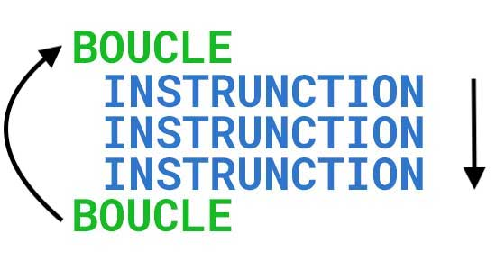

# LES BOUCLES

## Utilité

Les boucles permettent de répéter des instructions tant que la/les conditions sont respectées.

## Comportement

Lorsque nous écrivons un code simple, les instructions s'executent de haut en bas sans revenir en arrière.

Lorsque nous écrivons un code utilisant une boucle, les instructions vont s'executer de haut en bas, dès qu'il arrive en bas, il retourne en haut éxecuter à nouveau les instructions jusqu'a ce que la condition ne soit plus respectée.




### Exemple n°1

Nous souhaitons afficher 100 fois à l'écran le texte **MON MESSAGE**, deux posibilités s'offrent à nous
- Soit écrire 100X le message ce qui serait fastidieux
- Soit utiliser une boucle qui va venir répéter 100X cette instruction

```php
// BOUCLE{}
    echo 'MON MESSAGE';
// FIN DE BOUCLE

```


### Exemple n°2

Nous récupérons 100 utilisateurs en base de données et nous souhaitons les lister.

Deux possibilités

- Soit les lister à la main ce qui est fastidieux

```php
    echo '<ul>';
    echo '<li>' .$utilisateurs[0]['nom']. '</li>';
    echo '<li>' .$utilisateurs[1]['nom']. '</li>';
    echo '<li>' .$utilisateurs[2]['nom']. '</li>';
    …
    echo '<li>' .$utilisateurs[99]['nom']. '</li>';
    echo '</ul>';-

```

Soit utiliser une boucle (FOREACH) pour tous les afficher

```php
echo '<ul>';
foreach($utilisateurs as $utilisateur) {
    echo '<li>' .$utilisateur['nom']. '</li>';
}

echo '</ul>';
```


Dans le premier cas, je décide d'afficher 100 utilisateurs, si je décide en base de données de rajouter un utilisateur, je vais devoir adapter mon code alors qu'avec la boucle non.


## BOUCLE WHILE

Une boucle while se décompose avec le mot clé `while` suivi de parenthèses dans lesquelles on va rajouter une expression devant retourner `true` ou `false` (même fonctionnement que pour les conditions). Tant que l'expression renvoie `true`, on continuera à boucler et executer X fois le code se trouvant à l'intérieur des accolades
Si la condition renvoie: `null, 0, false ou []`la condition n'est plus respectée

### Exemple 
```php
while (/* condition */) {
    // instruction à répéter
    // instruction à répéter
    // instruction à répéter
}
```

Généralement, on utilise les boucles `while` quand on ne connait pas le nombre de fois que l'on doit itérer.

### Exemple de boucle while

```php
$i = 0;
while ($i < 5) { // condition
    echo 'bonjour n°' . $i;
    $i++; // incrémentation 
}
```

La condition indique que l'on doit parcourir la boucle tant que `$i` est plus petit que 5, à l'intérieur de la boucle on incrémente `$i`de plus 1 à chaque passage. Le message *bonjour n°x* sera affiché 5 fois.


Ici la condition est toujours **vraie** ce qui implique que les instructions à l'intérieur de la condition vont se répéter à l'infini (voir faire planter le navigateur);


## BOUCLE  DO WHILE

```php
do {

}
while (/* condition */)
```

## FOR
La boucle `for` est a utiliser si vous savez le nombre de fois que vous souhaitez itérer, exemple je souhaite afficher 100X le même message.


```php
for(/*initialisation*/;/*condition*/;/*incrementation*/) {

}
```

## FOREACH

La boucle `foreach` est le moyen le plus simple si vous souhaitez itérer sur des tableaux ou des objets (instances de classe non vu  au cours).


## Structure

Voici la structure d'une boucle `foreach`

```php
foreach(/*tableau*/ as /*element sur lequel on itère*/) {

}
```
- Premier paramètre est le tableau sur lequel on souhaite itérer (`/*tableau*/`)
- Ensuit le mot clé `as`
- Deuxième paramètre est une variable que l'on crée (on peut la nommer comme on le souhaite) qui va contenir l'élement sur lequel on est en train d'itérer (`/*element sur lequel on itère*/`)


Exemple

Je souhaite boucler sur un tableau de prénoms, voici comment je vais procéder

```php
// mon tableau de prénoms
$prenoms = [
    'Maurice',
    'Bob',
    'Emile',
    'Martine'
    ];

// la boucle
foreach($prenoms as $prenom){
    echo $prenom . '<br>';
}    
```
- `$prenoms` avec un **s** est le tableau contenant les prénoms sur lequel je souhaite itérer (parcourir)
- `$prenom` sans **s** est une variable que je crée qui va contenir en valeur un prénom du tableau sur lequel j'itère, à chaque fois que je vais itérer cette variable sera mis à jour avec le prénom suivant, 


### Parcourir un tableau foreach en récupérant les clés


Avec `foreach` vous avez la possibilité de récupérer la clé et la valeur de l'élement sur lequel vous itérez, pour y arriver une adaptation est à opérer sur la boucle

au lieu d'avoir ceci

`foreach($prenoms as $prenom)`

vous allez avoir celà

`foreach($prenoms as $key => $prenom )`


Exemple

```php
$prenoms = [
    'Maurice',
    'Bob',
    'Emile',
    'Martine'
    ];

foreach($prenoms as $key => $prenom ){
    echo $prenom . '<br>';
}   
```

ici nous avons ajouté le code suivant ` $key => `, cela permet de


### Instruction break

L'instruction `break`, vous permet de quitter une boucle ou un switch, cela peut être utile si vous souhaitez itérer jusqu'a ce que vous trouviez le bon élément

Exemple, je souhaite récupérer tous les utilisateurs et m'arrêter dès que je trouve au moins 2 monsieurs.

```php
$users = [
    [
        'civilite' => 'Monsieur',
        'prenom' => 'José',
    ],
    [
        'civilite' => 'Madame',
        'prenom' => 'Marie',
    ],
    [
        'civilite' => 'Monsieur',
        'prenom' => 'Bob',
    ],
    [
        'civilite' => 'Monsieur',
        'prenom' => 'Claude',
    ],
];

$total = 0;
foreach($users as $user) {
    echo 'Bonjour '. $user['prenom'] . '<br>';
    if($user['civilite'] == 'Monsieur'){
        $total++;
    }
    if($total == 2) {
        break;
    }
}

```


### Instruction continue

L'instruction `continue` permet de sauter des instructions à l'intérieur du boucle.

Pour donner un exemple concret, je souhaite afficher les nombres de 1 à 10, mais ne pas afficher le nombre égale à 4.

```php
for ($i=1;$i<=10;$i++) {
    if ($i=== 4){
        continue;
    }

    echo $i . '<br>';
}
```

Dès que l'instruction `continue`, elle passe directement au niveau de la réitération de la boucle sans exécuter les instructions qui étaient plus bas. 


### Exemples de boucles infinies

Voici deux exemples de boucles infinies

```php
while (true) {
    echo 'message<br>';
}
```

```php
for(;;){
    echo 'message<br>';
}
```


