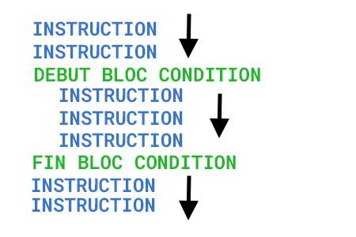
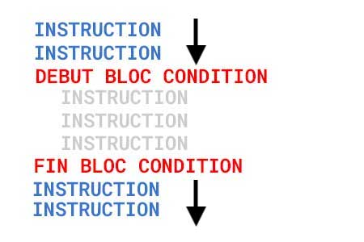

# Les conditions

Les conditions sont des instructions qui vont vous permettre d'executer ou non un bloc d'instruction(s).
Si la condition est remplie on execute le code, sinon on exclue le bloc de la condition.


## Cas d'utilisation dans une application

### Exemple 1

Une personne arrive sur mon site web, en fonction de l'heure à laquelle il se connecte, je souhaite lui afficher un message dynamique pour le saluer de la meilleure des façons 

- Bonjour, comment allez-vous ? (au matin)
- Bon après midi, comment allez-vous ? (durant la journée)
- Bonsoir, comment allez-vous ? (au soir)

Comment vais-je procéder pour y arriver ?

Tout simplement, dans un premier temps je vais écrire ces 3 instructions et dans un second temps je vais utiliser la puissance des conditions pour executer la bonne et ne pas prendre en compte les autres.


### Exemple 2

Une personne se rend sur mon site de vente d'alcool, avant de poursuivre sur le site, il faut lui demander s'il est majeur ou pas.
A sa première connexion, une popup s'affiche pour lui poser la question, en fonction de la réponse nous allons executer l'instruction adéquat

- s'il est majeur on lui affiche le site
- s'il n'est pas majeur on le redirige vers le site précédent

Même principe que pour l'exemple précédent, ces deux instructions vont se trouver dans le code, mais une seule des deux sera executé en fonction de la réponse que l'utilisateur aura indiquée.


## Comment ça fonctionne

Dans l'exemple ci-dessous **la condition** est respectée ce qui implique que toutes les instructions seront executées




Dans l'exemple ci-dessous **la condition** n'est pas respectée ce qui implique que les instructions se trouvant à l'intérieur du bloc condition ne seront pas executées, seule celles à l'exterieur du bloc le seront.




## L'instruction IF

La première instruction à connaitre quand on écrit des conditions est le `if` qui signifie **si**, cette instruction attend à l'intérieur une expression qui doit retourner soit `true` ou `false`

Exemple

```php

if (true) {
    echo 'MESSAGE'; // CETTE INSTRUCTION SERA EXECUTEE CAR LA CONDITION EST VRAIE
}

if (false) {
    echo 'MESSAGE'; // CETTE INSTRUCTION NE SERA PAS EXECUTEE CAR LA CONDITION N'EST PAS VRAIE
}
```


:warning: Attention

 - les parenthèses **( )** juste après le `if` sont obligatoires, c'est à l'intérieur de celles-ci que l'on va placer le ou les expressions qui vont indiquer si la condition est vraie ou false (`true` ou `false`)
 - Les accolades **{ }** ouvrantes et fermantes vont englober le code qui sera executé sous conditions, elles ne sont pas obligatoire mais fortement recommandée. Si vous n'ajoutez pas d'accolades, une seule instruction sera associé à la condition.


## Condition PHP: ELSE

La seconde instruction à connaitre est le `else` qui signifie **sinon**, comparé au `if` lui n'attend pas qu'on lui passe une expression qui renvoie `true` ou `false`.

:exclamation: Important: elle doit toujours se placer à la suite d'un `if` car ça n'a pas de sens de l'utiliser seul et que vous allez provoquer une erreur

Exemple

```php
$civilite = 'monsieur';

if($civilite == 'monsieur') {
    echo 'Bonjour monsieur';
} else {
    echo 'Bonjour madame';
}
```


## Condition PHP: ELSE IF

Dernière condition à connaitre est le `else if` ou `elseif`(en PHP les deux syntaxes sont autorisées), elle a le même comportement que `if`, elle attend l'utilisation d'une expression.


:exclamation: Important: elle doit toujours se placer à la suite d'un `if` et avant un `else`


Exemple

```php
$civilite = 'monsieur';

if ($civilite == 'monsieur') {
    echo 'Bonjour monsieur';
} else if($civilite == 'madame') {
    echo 'Bonjour madame';
} else {
    echo 'Inconnu';
}
```


## Ordre des instructions

Lorsque vous écrivez une condition, vous devez toujours démarrer par un `if`, ensuite vous enchainez avec des instructions optionnelles `elseif` et `else`, par contre vous devez respecter l'ordre, `elseif` si vous l'utilisez devra toujours se placer entre le `if` et le `else`.

 - `if`
 - `else if`
 - `else`

 Qans vous écrivez un bloc contenant une codition, vous ne pouvez avoir qu'une seule fois le `if` et le `else` et plusieurs fois le `elseif`. Si le cas se présente, il est peut être possible d'utiliser un `switch`


 ## Expression à l'intérieur d'une condition

A l'intérieur d'une condition `if` ou `else if` on attend une expression qui renvoie soit `true` ou `false`, dans les exemples précédents nous avons directement indiquez la valeur `true` ou `false` pour les exemples, mais cela ne rend pas le code dynamique.
Quand on ajoute une expression dans une condition on va venir en général comparer une information à une autre, voir même plusieurs informations (voir Opérateurs logiques)

**Voici la liste des opérateurs qui vont nous permettre d'éffectuer des comparaisons et renvoyer `true` ou `false` **

| Opérateur de comparaison  |  Définition |
|------|----------------------------------------------|
|  ==  |  Tester l'égalité sur les valeurs            |
|  === |  Tester l'égalité sur les valeurs et le type |
|  !=  |  Tester si les valeurs sont différentes      |
|  <>  |  Tester si les valeurs sont différentes      |
|  <   |  Tester si inférieur                         |
|  >   |  Tester si supérieur                         |
|  >=  |  Tester si inférieur ou égale                |
|  <=  |  Tester si supérieur ou égale                |

Exemple, hors d'une condition.

```php
$maVariable = 'Hello';
$maVariable2 = 'SALUT';

$maVariable == $maVariable2; // renvoie false
$maVariable == 'Hello'; // renvoie true
$maVariable == 1; // renvoie false
$maVariable == 10.5; // renvoie false
```

:warning: l'exemple précédent va retourner un booléan, mais ne va pas imprimer le résultat à l'écran car on ne lui dit pas de le faire.


// OPERATEUR TERNAIRE


Une condition englobe un ensemble d'instructions de 1 à X, si à l'intérieur d'une condition aucune instruction n'est placée cela veut dire qu'il y a un souci de conception dans le code.


# Les conditions


# EXERCICES

- Créez un nouveau fichier PHP `4.php` pour effectuer les exercices suivants


## EXERCICE 1

- [ ] Créez une variable `$prixTVA` dans laquelle vous allez y stocker le prix avec la TVA
- [ ] Utilisez les conditions pour comparer le `$prixTVA`  et en fonction du montant afficher le bon message (exemple: si > 100: `prix supérieur à 100€` )


```php
$prixHT = 90;
$tva = 21;


echo 'prix supérieur à 100€';

echo 'prix égale à 100€';

echo 'prix inférieur à 100€';


```


## EXERCICE 2

Utilisez des conditions pour afficher le bon message:


Bonjour `Monsieur ou Madame` vous êtes `âgés ou jeune`;


```php
// 1: Monsieur, 2: Madame
$civilite = 1;

// 70: agés  en dessous: jeune
$age = 30;

```


## EXERCICE 3

le `++` permet d'incrémenter +1 à un nombre

Exemple

```php
// Exemple 1
$i = 10;
$i++;
echo $i; // imprime à l'écran 11

// Exemple 2
$age = 32;
$age++;
echo $age; // imprime à l'écran 33
```

Pouvez vous m'éxpliquez pourquoi le code suivant va imprimer à l'écran `Egale` ?

```php
$e = 20;

if($e++ == 20){
    echo "Égale";
} else {
    echo "Non égale";
}

```


## LA VIDEO RECAP

 [Video](https://www.youtube.com/watch?v=o3xCpnXFIOI)