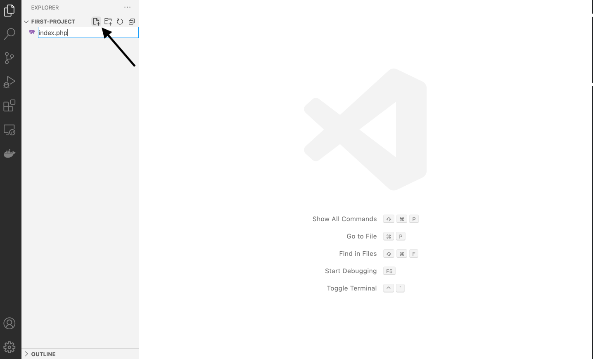

# Ma première page

Quand votre environnement de travail est en place (installation de la WSL2 ubuntu 20 et l'IDE VS code) nous pouvons créer notre projet et y ajouter notre première page.


## Création de mon projet

Ouvez votre terminal Ubuntu et lancez les commandes suivzantes:

:warning:  Attention, vérifiez bien que chaque ligne que vous écrivez ne vous retourne pas une erreur ! si c'est le cas vous devez trouver une solution, copier/coller le message d'erreur dans un moteur de recherche pour voir si quelqu'un a déjà eu le problème et s'il a trouvé une solution.


```console
foo@bar:~$ mkdir first-project
foo@bar:~$ cd first-project
```
- `mkdir first-project` permet de créer un repertoire portant le nom `first-project`
- `cd first-project` permet de se rendre dans la repertoire que l'on vient de créer (cd signifie change directory).


### Ouvrir son projet avec VS code 

```console
foo@bar:~$ code .
```

La commande `code` permet de démarrer VS code, le `.` permet de dire à VS code ouvre moi le projet dans le repetoire dans lequel je me situe.

:warning: si la commande code n'est pas connue, regardez dans la documentation pour trouver une solution [ici](https://code.visualstudio.com/docs/remote/wsl) 


## Ma première page

Lorsque vous êtes dans l'IDE (VS code), cliquez sur la premier icon en haut à gauche, celui qui est le plus proche du nom de votre projet `FIRST-PROJECT`, cet icon va vous permettre de créer un fichier que vous allez appeler `index.php`




pourquoi `index.php` ?

- l'extension php pour indiquer que ce fichier est un fichier de type PHP, qu'il contient du code et qu'il la considérer comme tel.
- `index`, quand vous vous rendez sur un site web par défaut la première page qui est appelé en fonction de la configuration de votre serveur est la page `index`


### Mes premières lignes de code

```php
<?php
echo 'Hello World';
```

- `<?php` est la balise d'ouverture PHP, le code qui le précède sera interprété par PHP.
- `?>` est balise de fermeture de PHP (non présente dans l'exemple ci-dessus) le code qui la précède ne sera pas interprété par PHP, il sera lu comme tel.
- `echo 'Hello World';` `echo` permet d'imprimer une information à l'écran ici **Hello World** 

:warning: A la fin de chaque instruction, il faut rajouter un `;`pour indiquer que celle-ci est terminée et que l'on peut passer à la suivante.


## Lancer un serveur Web de test

Maintenant que votre première page est créée, nous devons lancer un serveur web pour pouvoir executer le code et voir le résultat

Rendez-vous dans votre terminal à l'intérieur de votre projet et lancez la commande suivante

```console
foo@bar:~$ php -S 0.0.0.0:8900
```

- `php -S`permet de lancer un serveur Web grâce à PHP (Serveur de test!)
- `0.0.0.0` est une adresse IP qui indique que vous lancez l'application sur toutes vos interfaces réseau (WIFI, Ethernet, local), si vous ne souhaitez que le lancer depuis votre local `127.0.0.1`
- `:8900` indique que vous lancez votre application sur le port `8900` par défaut une application est lancée sur le port 80 en `http` et sur le port `443` en `https`


si vous n'avez pas eu d'erreur vous pouvez vous rendre sur un navigateur (chrome par exemple) et rentrez l'url suivante

`127.0.0.1:8900` ou `localhost:8900` et vous devriez voir votre message Hello Worl s'afficher.


